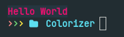
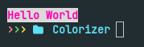
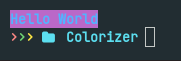

# Colorize-C

> A library for colorizing texts in terminal.

<h1 align="center">Demo</h1>
<p align="center" width=100%">
  
  &nbsp; &nbsp;
  
</p>

<br>

## Table of Contents

- [Supported Platforms](#supported-on)
- [Usage](#using-at-a-glance)
- [Installation](#installation)
- [Documentation](/docs/documentation.md)

<br>

## Supported on

> - [x] Linux
> - [x] MacOS
> - [x] Windows  <sup>Terminal-Emulator Needed! <sup> Win-Terminals are crappy so, kinda working...</sup></sup>

<br>

# Using at a glance

### 24 BIT <sup>TrueColor</sup>
```C
// 24 BIT provides a color set of 16,777,216 colors.
char *text = NULL;
text = crich24V("Hello World", 0xeb106f, 0x263640, BOLD);
printf("%s\n", text);
```
##### which gives


<br>

### 8 BIT <sup>0-255</sup>
```C
// 8 BIT provides a color set of 0-255 colors.
char *text = NULL;
text = crich8V("Hello World", 199, 253, BOLD);
printf("%s\n", text);
```
##### which gives


<br>

### 3/4 BIT <sup>8/16</sup>
```C
// 3/4 BIT provides a color set of 8/16 colors.
char *text = NULL;
text = crich8V("Hello World", FOREGROUND_LIGHT_Blue, BACKGROUND_Magenta, BOLD);
printf("%s\n", text);
```
##### which gives



<br>

# Installation
Since it's **Header-Only**,
<br>
Just copy and paste [**`colorize-c.h`**](/src/colorize-c.hpp) next to your **Project/Path** (`e.g. /usr/include/ on linux`)
