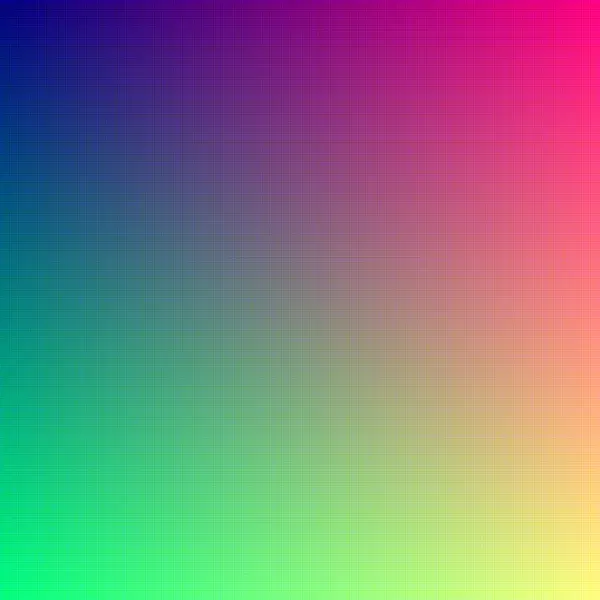
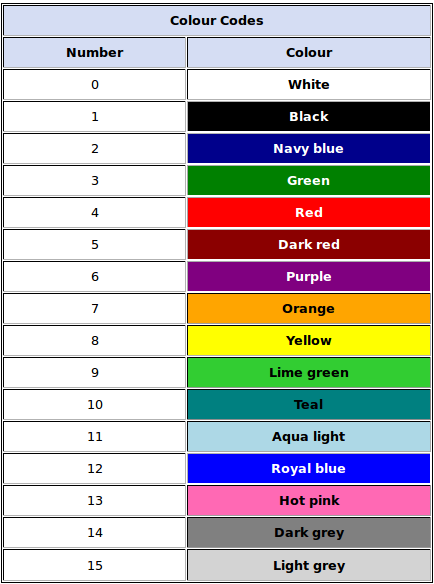
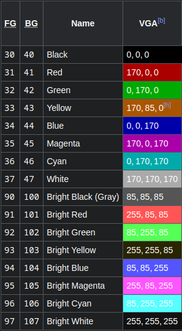

## Table of Contents

- **Getting Started**
    - [Brief discussion](#brief-discussion)
    - [Structure & Component](#structure)
    - **Use By**
      - [Value](#use-by-value)
      - [Reference](#use-by-reference)
    - [Colors](#colors)
    - [Styles](#styles)
    - [Formatting](#formatting)
        
- [References](#references)

<br>

# Brief Discussion

Colorize provides you with 3 ways of colorizing texts.

1. [**24 BIT**](#24-bit-or-true-color)
2. [**8 BIT**](#8-bit)
3. [**3/4 BIT**](#34-bit)

# 24 BIT or True Color
Modern OSs (`e.g. MacOS, Linux`) and Terminal Enulators (`e.g. Alacritty, Secure ShellFish, Blink Shell, KDE Konsole, etc.`) can and do support True Coloring scheme, which consists of about 16 million colors.

<h3 align="center">True Color Palette</h3>
<p align="center" width="100%">
  
</p>

<br>

# 8 BIT
Mostly supported on any UNIX like OSs and Terminal Enulators.

<h3 align="center">8 Bit Color Palette</h3>
<p align="center" width="100%">
  
</p>

<br>

# 3/4 BIT
This coloring scheme is supported on systems since 1980s so, yours mostly supports it too.

<h3 align="center">3/4 Bit Color Palettes</h3>
<h6 align="center">Note: Color names are a bit off, so this is just an example to give you the idea</h6>
<p align="center" width="100%">
  
  
</p>

<br>

***

# Structure

### 24 BIT <sup>[TrueColor](#24-bit-or-true-color)</sup>

- #### Use by value
  ```C
  char *text = NULL;
  text = crich24V("Hello World", 0xeb106f, 0x263640, BOLD);
  printf("%s\n", text);
  ```
  ```C

  char *text = NULL;
  
  text = crich24V(
              "Hello World" /* Text : const char *const */,
              0xeb106f /* Foreground-Color : Hex */,
              0x263640 /* Background-Color : Hex */,
              BOLD /* Styles : enum emphasis */
  );
  
  printf("%s\n", text);
  ```

<br>

### 8 BIT <sup>[0-255](#8-bit)</sup>

- #### Use by value
  ```C
  char *text = NULL;
  text = crich8V("Hello World", 199, 253, BOLD);
  printf("%s\n", text);
  ```
  ```C
  char *text = NULL;

  text = crich8V(
              "Hello World" /* Text : const char *const */,
              199 /* Foreground-Color : ColorCode */,
              253 /* Background-Color : ColorCode */,
              BOLD /* Styles : enum emphasis */
  );

  printf("%s\n", text);
  ```

<br>

### 3/4 BIT <sup>16 <sup>[**1**](https://github.com/HeavySin/Colorize/blob/16ca987ecb9c1fbeb159e493b6a23ea7a2e47e8b/src/colorize.hpp#L70-L114), [**2**](#34-bit)</sup></sup>

- #### Use by value
  ```CPP
  char *text = NULL;
  text = crich4V("Hello World", FOREGROUND_LIGHT_Blue, BACKGROUND_Magenta, BOLD);
  printf("%s\n", text);
  ```
  ```CPP
  char *text = NULL;
  
  text = crich4V(
              "Hello World" /* Text : const char *const */,
              FOREGROUND_LIGHT_Blue /* Foreground-Color : enum BIT_4_COLORS */,
              BACKGROUND_Magenta /* Background-Color : enum BIT_4_COLORS */,
              BOLD /* Styles : enum emphasis */
  );
  
  printf("%s\n", text);
  ```

***

## Use by value
These functions **✖ cannot** take their Color parameters as a reference.
##### Examples:
```C
// Wrong ❌
int foregroundColor = 0xeb106f;
int backgroundColor = 0x263640;

crich24V("Hello World", foregroundColor, backgroundColor);
```
```C
// Correct ✅
rich24V("Hello World", 0xeb106f, 0x263640);
```

## Use by reference
These functions **✔ can** take their Color parameters as a reference.
###### Not implemented. Since it's much faster to pass int by value instead of reference.

As you might be noticed, the only difference between the **Use by Value and Reference** is in the way that they get their parameters.

# Colors
You can use different ranges of colors, contrary to the intended function.

|                   |   crich4   |   crich8   |   crich24   |
|       :---:       |    :---:   |    :---:   |    :---:    |
|  **Color-Range**  | `0` through `15` <sup>&#8226; **See** [**1**](https://github.com/HeavySin/Colorize/blob/16ca987ecb9c1fbeb159e493b6a23ea7a2e47e8b/src/colorize.hpp#L70-L114), [**2**](#34-bit)</sup> | `0` through `255` <sup>&#8226; **See** [**1**](#8-bit)</sup>  | `#000000` through `#ffffff` <sup>&#8226; **See** [**1**](#24-bit-or-true-color)</sup>  |
|   **No-Color**    | `≤ -1` | `≤ -1` or `255 <` | `≤ -1` or `#ffffff <`      |

Let's say you just want to add a *Background Color* and you want the *Foreground Color* to be nothing (or rather unchanged).
You'll just have to use an `out-of-range` Color-Code as mentioned in the table, **like**:
```C
crich24V("Hello World", -1, 0x263640);

// or
crich24V("Hello World", 0xeb106f, -1);

// or
crich8V("Hello World", 256, 253);

// or
crich8V("Hello World", 199, -1);

// or even
crich8V("Hello World", 923, -3247);
```

so there is no worrying about getting crashed!

# Styles
As you can see in here,

https://github.com/HeavySin/Colorize-C/blob/9ea5c1fa0b68bb1a61727fb80735fbc671b1532e/src/colorize-c.h#L44-L60

There are quite a few styles that you can use despite the ColorScheme or method that you are using.

##### Refer to [here](https://en.wikipedia.org/wiki/ANSI_escape_code#SGR_(Select_Graphic_Rendition)_parameters) for more styles.

You can use multiple styles at once via enum flagging!
##### Example
```C
crich24V("Hello World", 0xeb106f, 0x263640, BOLD | ITALIC | UNDERLINE);
```

<br>

# Formatting

There are also formatting functions that you can use despite the ColorScheme or method that you are using.
They allow you to perform [**`printf`**](https://cplusplus.com/reference/cstdio/printf/) like string formatting!
```
crich24Vf(0xeb106f, 0x263640, 0, "name: [%s] | age: %hu", "Johan", 23);

crich8Vf(199, -1, 0, "name: [%s] | age: %hu", "Johan", 23);

crich4Vf(FOREGROUND_LIGHT_Blue, BACKGROUND_Magenta, BOLD, "name: [%s] | age: %hu", "Johan", 23);
```
The only difference is between their naming conventions which ends with 'f'.

<br>

# Notice
As you may have noticed, we passed 0 for the style parameter, and every time we use any function, we have to pass all the parameters because, unfortunately, there is no `default argument` in C.
So if you want no style at all, pass 0 (DO NOT PASS -1 OR ANYTHING ELSE) as the parameter, and for the color, pass an [`out-of-range`](#colors) Color-Code

---

# References
##### Full explanation at holly [**WikiPedia**](https://en.wikipedia.org/wiki/ANSI_escape_code)

## See also:
- [ANSI Escape Codes - Github](https://gist.github.com/fnky/458719343aabd01cfb17a3a4f7296797)
- [ANSI Escape Codes - StackOverflow](https://stackoverflow.com/questions/4842424/list-of-ansi-color-escape-sequences)
- [Build your own Command Line with ANSI](http://www.lihaoyi.com/post/BuildyourownCommandLinewithANSIescapecodes.html)
- [Difference between color schemes](https://www.computerhope.com/issues/ch001557.htm)
- [Color depth](https://en.wikipedia.org/wiki/Color_depth#True_color_.2824-bit.29)
